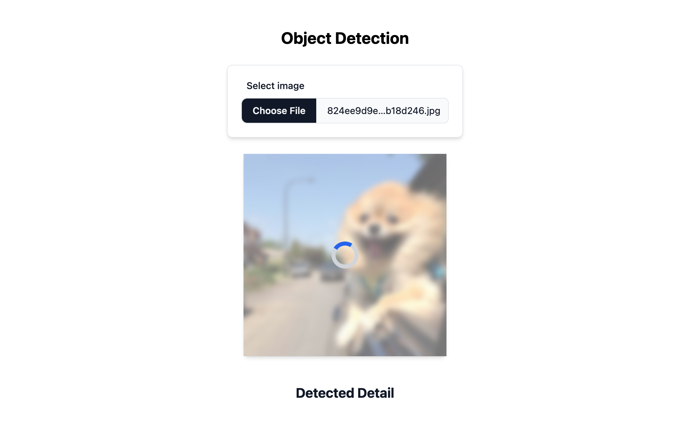

Object Detector

Live Demo: https://mechapear.github.io/object-detection/

## Features

- Upload an image file for object detection
- Display the image with the bounding box and the details of the detected object 
    - including the object’s name, category, and the minimum confidence score of the prediction results
- Hover over the detail box to highlight the object in the image
- Handle loading state
- Responsive design

## Resources

- [Nvision Object detection API](https://docs.nvision.nipa.cloud/how-to-guides/detect-objects)
